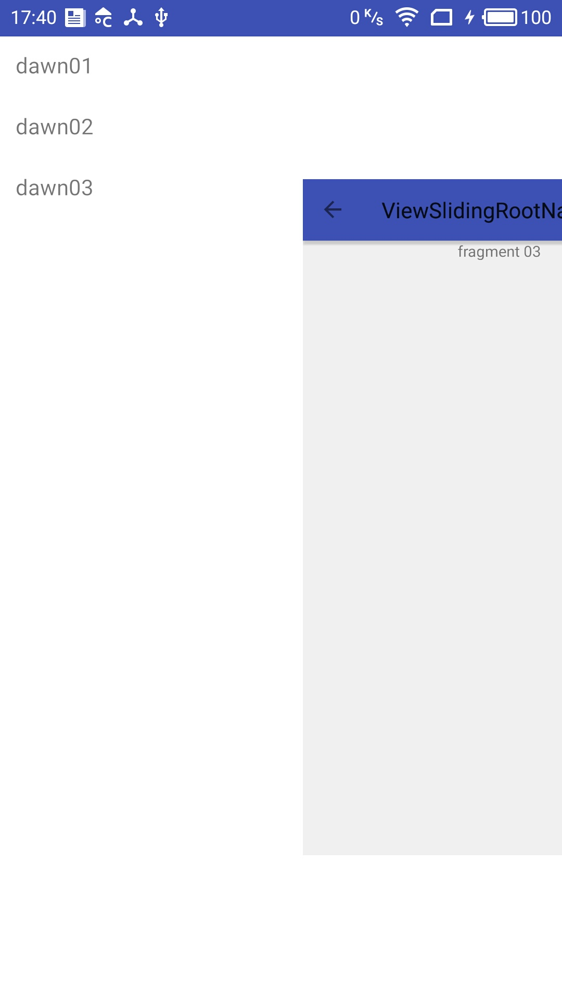

# Sliding Root Nav 的使用

* [引用](#引用)
* [使用](#使用)
* [参考地址](#参考地址)


## 引用
build.gradle里面：
```
dependencies {
 compile 'com.yarolegovich:sliding-root-nav:1.0.2'
}
```



## 使用
```
new SlidingRootNavBuilder(this)
    .withMenuLayout(R.layout.menu_left_layout)
    .inject();
```
这个是最基本的

属性：

* withDragDistance  向右侧移动的距离，默认180dp
* withRootViewScale  主页面的透明度
* withMenuOpened    初始是否打开状态，默认false，关闭
* withMenuLocked    锁定menu，如果为true，将不能打开和关闭menu
* withGravity     SlideGravity.LEFT左侧显示, SlideGravity.RIGHT右侧显示，默认左侧  
* withToolbarMenuToggle   设置toolBar
* inject          返回SlidingRootNav接口


SlidingRootNav接口中的方法有：
```
public interface SlidingRootNav {
    boolean isMenuHidden();
    boolean isMenuLocked();
    void closeMenu();
    void closeMenu(boolean animated);
    void openMenu();
    void openMenu(boolean animated);
    void setMenuLocked(boolean locked);
    SlidingRootNavLayout getLayout(); //If for some reason you need to work directly with layout - you can
}
```

withMenuView  这个添加menu的View
withMenuLayout 这个添加menu的Layout

其中添加Layout后，可以直接通过findViewById获取到控件，进行事件操作


## 参考地址

[https://github.com/yarolegovich/SlidingRootNav](https://github.com/yarolegovich/SlidingRootNav "参考地址")
